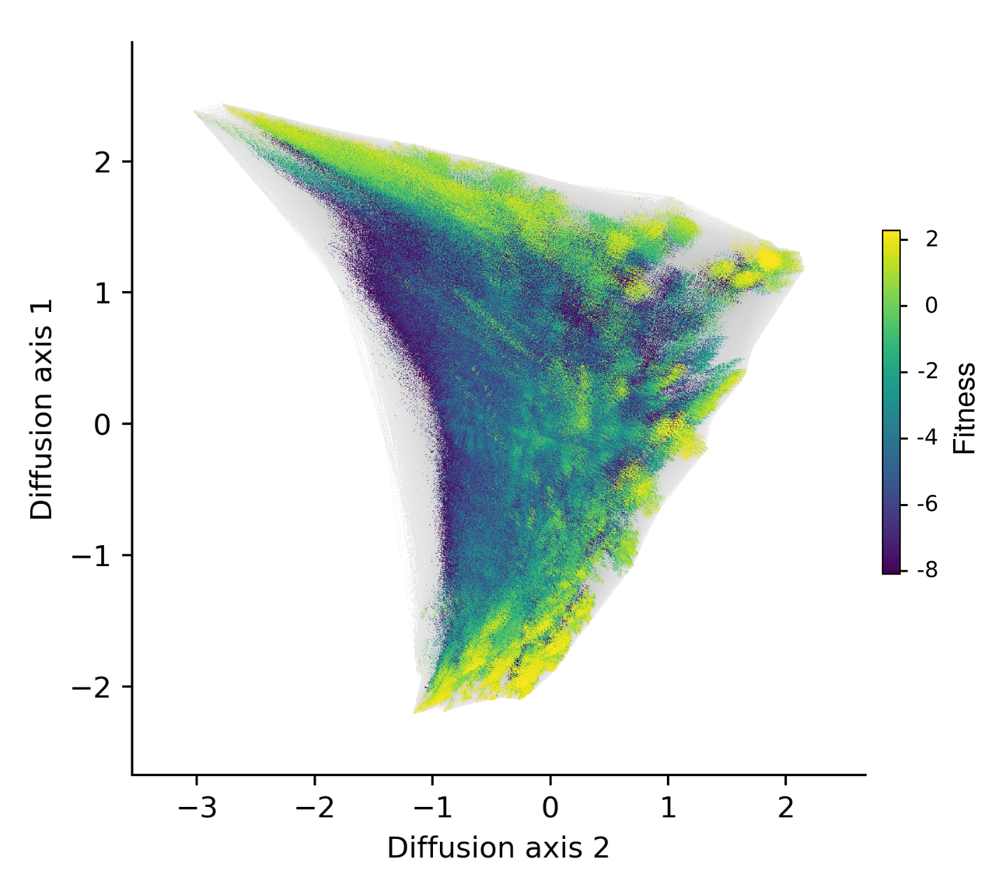

=====================================================================================
gpmap-tools: tools for inference and visualization of complex genotype-phenotype maps
=====================================================================================

``gpmap-tools`` was created to integrate and standardize methods developed in the 
`McCandlish Lab <https://www.cshl.edu/research/faculty-staff/david-mccandlish/#research>`_ 
for the inference, analysis, and visualization of complex genotype-phenotype maps 
comprising up to millions of genotypes.

For example, this is a low-dimensional representation of a 12-nucleotide genotype-phenotype map
comprising 16 million genotypes, where fitness depends on the 4-amino acid sequence they encode
under the standard genetic code. This visualization illustrates how the vast set of functional sequences
is accessible to one another under a given evolutionary model and highlights the long, winding mutational
paths required to evolve sequences differing at only a few amino acid positions.

Inference
=========

``gpmap-tools`` implements a suite of Gaussian process models for the
inference and analysis of complete genotype-phenotype maps.

- `Juannan Zhou and David M. McCandlish. Minimum epistasis interpolation for sequence-function relationships (2020) <https://www.nature.com/articles/s41467-020-15512-5>`_
- `Juannan Zhou, Mandy S. Wong, Wei-Chia Chen, Adrian R. Krainer, Justin B. Kinney, David M. McCandlish. Higher order epistasis and phenotypic prediction (2022) <https://www.pnas.org/doi/full/10.1073/pnas.2204233119>`_
- `Wei-Chia Chen, Juannan Zhou, Jason M. Sheltzer, Justin B. Kinney, David M. McCandlish. Field theoretic density estimation for biological sequence space with applications to 5' splice site diversity and aneuploidy in cancer (2021) <https://www.pnas.org/doi/10.1073/pnas.2025782118>`_
- Carlos Martí-Gómez and David M. McCandlish. Inference of fitness landscapes with heterogenous patterns of epistasis across sites (2026). In preparation.

These models are implemented within a unified framework inspired by the classical 
machine learning library `scikit-learn <https://scikit-learn.org/>`_, defined
as classes with the common methods ``fit`` and ``predict`` to infer hyperparameters and
make phenotypic predictions, respectively. Among other things, ``gpmap-tools`` allows
to:

- Estimate the magnitude of genetic interactions of different orders from experimental measurements. 
- Infer a complete combinatorial genotype-phenotype maps containing millions of sequences from experimental measurements and observations of natural sequences. 
- Predict the phenotypes of unobserved genotypes with associated uncertainty.
- Estimate the effects of mutations in specific and possibly unobserved genetic backgrounds with associated uncertainty.
- Compute the variance explained by interactions of different orders involving combinations of sites in a complete genotype-phenotype map.

Visualization
=============

``gpmap-tools`` also provides a new and accessible implementation of a 
previously described powerful method to visualize complex genotype-phenotype maps.

- `David M. McCandlish. Visualizing fitness landscapes (2011) <https://onlinelibrary.wiley.com/doi/10.1111/j.1558-5646.2011.01236.x>`_

More specifically, ``gpmap-tools`` allows to:

- Compute the coordinates of the low-dimensional representation of a genotype-phenotype map.
- Write and read intermediate files in efficient and fast ``parquet`` and ``npz`` formats.
- Plot the low-dimensional representation efficiently using different backends with varying degrees of computational speed and flexibility. For example, using `datashader <https://datashader.org>`_, we can render visualizations of genotype-phenotype maps with millions of genotypes efficiently.
- Identify the sequence features that characterize different regions of the genotype-phenotype map with additional plotting functionalities.

History and applications
========================

Initially designed as an internal library to allow new lab members and students to 
analyze high-throughput combinatorial datasets without requiring advanced expertise
in the original code, we have used ``gpmap-tools`` in a number of collaborative studies
to address a broad range of interesting biological questions by understanding the structure
of high-dimensional genotype-phenotype maps: 

- How do mutations in the hydrophobic core of the GFP protein interact with each other and how can they be leveraged to design proteins with new functionality?  
    
    `Jonathan Yaacov Weinstein, Carlos Martí-Gómez, Rosalie Lipsh-Sokolik, Shlomo Yakir Hoch, Demian Liebermann, Reinat Nevo, Haim Weissman, Ekaterina Petrovich-Kopitman, David Margulies, Dmitry Ivankov, David M. McCandlish & Sarel J. Fleishman. Designed active-site library reveals thousands of functional GFP variants (2023) <https://www.nature.com/articles/s41467-023-38099-z>`_
    
- How can functional orthogonality arise in pairs of interacting proteins?  
    
    `Ziv Avizemer, Carlos Martí‐Gómez, Shlomo Yakir Hoch, David M. McCandlish, Sarel J. Fleishman. Evolutionary paths that link orthogonal pairs of binding proteins (2025) <https://www.cell.com/cell-systems/abstract/S2405-4712(25)00095-X>`_

- How does the structure of the genetic code influence the navigability of complex protein genotype-phenotype maps?  

    `Hana Rozhoňová, Carlos Martí-Gómez, David M McCandlish, Joshua L Payne. Robust genetic codes enhance protein evolvability (2024) <https://journals.plos.org/plosbiology/article?id=10.1371/journal.pbio.3002594>`_

``gpmap-tools`` is now available to the broader scientific community and provides
access to advanced computational techniques through just a few lines of Python code, 
while also extending its core functionalities. Find more details through the
documentation and in our preprint linked below.

Citation
========

- `Carlos Martí-Gómez, Juannan Zhou, Wei-Chia Chen, Arlin Stoltzfus, Justin B. Kinney, David M. McCandlish. Inference and visualization of complex genotype-phenotype maps (2026) <https://academic.oup.com/mbe/article/43/2/msag023/8456298>`_

YouTube Talk
============

We presented some of this work at the `Variant Effects Seminar Series <https://www.varianteffect.org/seminar-series>`_, and the 25-minute talk is publicly available
on its YouTube channel `here <https://www.youtube.com/watch?v=glQ0jllgdfY>`_. 

.. youtube:: glQ0jllgdfY

.. toctree::
    :maxdepth: 2
    :caption: Table of Contents

    installation
    usage/getting_started.ipynb
    inference
    usage/summary_statistics.ipynb
    visualization
    evolution
    usage/datasets.ipynb
    api 
